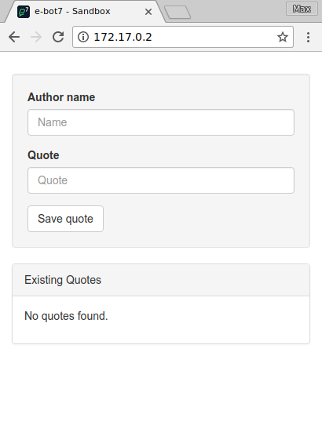

# e-bot7 Dev Sandbox

## Getting Started

### Vue.js and Feathers

You will need a basic understanding of the [Vue.js web framework](https://vuejs.org/) and the [Feathers API layer](https://feathersjs.com/) in order to complete this task.

### Provided Libraries

The application comes with a few npm libraries pre-installed, which you can see in the corresponding `package.json` files. The highlights are:

**Frontend**:

* Vue.js
* lodash
* font-awesome (icons)
* scss (may be used to style components)

**Backend**:

* Feathers
* lodash

Note: Your code should not rely on any libraries besides the ones already installed.


## The Basics

As you are reading this you have already successfully run the Makefile to start the application. You can visit the app at http://localhost:8380/ 

Navigate your browser to this page and you should see a simple web form:



This page will load the frontend application code. In most cases, it will automatically reload whenever source files are changed. In the rare exceptions where the auto-reload does not trigger, you will have to manually refresh the page to see your changes.

You should be able to enter some data and submit the form, which will send the data to the backend, where it is saved to the database. The saved data will then be displayed in the list below the form:


If you encounter any problems loading and displaying the application at any point, or if the basic functionality describe above does not work when you first try the application, be sure to ask for assistance.


### Files and Folders

The sandbox app consists of a backend and a frontend application. You will find the source code of the backend server in the `srv/` folder. The frontend code is located in the `web/` folder.


### Frontend (`web`)

The frontend is a simple [Vue.js web framework](https://vuejs.org/) application. The entry point is the file `src/main.js`, which contains the basic setup of Vue and the feathers client which will be used for communication with the server (see below).

You can see that the app is made from several [single file component files](https://vuejs.org/v2/guide/single-file-components.html). The main component is located at `src/Entry.vue`.

### Backend (`srv`)

The backend server is based on the [Feathers API layer](https://feathersjs.com/). The app comes prepared with a single service named `quotes` which can be accessed via REST. The service uses a MongoDB instance as backend and supports the basic CRUD operations.

Similiar to the web app, the server is automatically restarted as soon as a file is changed.


### Database

The MongoDB instance is used to persist data from the application. For the task below, you may freely add fields, collections, and indices as you seem fit.


## Task description

To get an understanding of the task at hand, picture the following scenario. An application has been developed for a client which enables users to post quotes to a central database. You have recently taken over this project and have received a couple of new requirements by the client.


### Part I: Group Quotes by Author

Change the homepage layout so that quotes are grouped by author. Each group of quotes should have the author's name as a header. Consider how to efficiently lay out the page for maximum readability.

### Part II: Make Quotes Editable

Replace the Quote and QuoteForm component with a single component called EditableQuote. EditableQuote should:

  * Have two views, a display and edit view. The display view should only show the quote. Clicking the component should cause the quote to disappear, and the author and quote to appear in text inputs. Only one quote should be in edit view at a time.
  * Automatically save changes to the server without requiring the user to click a button.
  * Indicate when changes are being saved, on both display and edit view.

### Part III: Add a Button For Adding a New Quote

Add a button for adding a new quote. Clicking this button should display an EditableQuote with no pre-filled input.

### Part IV: Search Bar (Bonus)

**Only do this task if you are satisfied with the completeness of all other tasks**

Create a search bar component which allows the user to search both authors and quotes. The filtered quotes should still be grouped by author. Highlight the matching text where it appears in either the quote or author. The search bar should check the server, not just the local quotes.

### Part V: Improving Database Performance

In the database there is another collection that has not been used in the application so far, named `archived-quotes`. It consists of a large archive of quotes which were gathered from different sources. The client does not want those quotes to be displayed to the user, but the archive should be checked whenever a new quote is added in order to find possible plagiarisms (see rule 3 of Part III).

Simply checking each document in the `archived-quotes` collection would be straightforward to implement, but due to the size of the collection such a test would take a long time to complete, which would result in the entire application slowing down. Implement a solution that allows these queries to run in a much shorter time.

### Part VI: Bug Fixes

In the `web` application, there is an unused component at `src/components/LoopyButton.vue`. It was meant to appear somewhere inside the form, but was removed due to faulty behaviour. The planned behaviour was that this button should display a number which is incremented by 1 each time it is clicked. Find the bug in the component and fix it.

## Submission

**Very Important!** In order for us to evaluate your submission please make sure all your changes are committed and these commits have been pushed to your git repository. 
```
git push
```
Once everything is pushed you can run `make clean` to free up all resources used by the docker container. We will review your result over the coming days and get back to you once we are finished :)

## Copyright

Copyright (C) e-bot7 GmbH - All Rights Reserved. Unauthorized copying and/or distribution of any file in this repository, via any medium is strictly prohibited.

